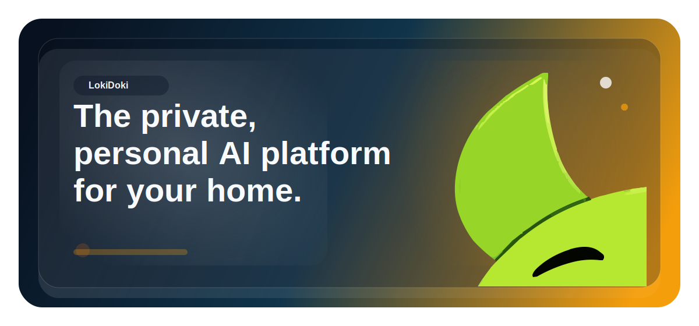

# LokiDoki

*The private, personal AI platform for your home.*



LokiDoki brings AI into the home without sending your life to the cloud. It runs on your hardware, keeps household data local, and gives each person their own companion with their own character, voice, settings, and guardrails.

>  Early development note: LokiDoki is already usable, but not every feature is fully built or polished yet.

## Features

<table>
  <tr>
    <td width="50%" valign="top">
       <strong>Private</strong><br><br>
      Runs on your hardware so conversations, settings, and memory stay at home.
    </td>
    <td width="50%" valign="top">
       <strong>No subscriptions</strong><br><br>
      No monthly AI bill and no cloud account required to make LokiDoki part of your home.
    </td>
  </tr>
  <tr>
    <td width="50%" valign="top">
       <strong>Smart AI</strong><br><br>
      Natural chat, document and image understanding, live vision, wake word, push-to-talk, and voice interaction.
    </td>
    <td width="50%" valign="top">
       <strong>For the family</strong><br><br>
      Recognizes who is there and adapts companions, settings, and care profiles for different people in one home.
    </td>
  </tr>
  <tr>
    <td width="50%" valign="top">
       <strong>Personal</strong><br><br>
      Shape each experience with voices, behavior, companion style, admin customization, and support for calmer or simpler replies.
    </td>
    <td width="50%" valign="top">
       <strong>Safe and in your control</strong><br><br>
      Set rules like no swearing, limit what each person can access, and manage household-wide and device-level permissions and guardrails.
    </td>
  </tr>
  <tr>
    <td width="50%" valign="top">
       <strong>Companions</strong><br><br>
      Give each person an animated AI character with its own face, voice, personality, and presence. Browse more in <a href="https://github.com/JesseWebDotCom/loki-doki-characters">loki-doki-characters</a> or create your own.
    </td>
    <td width="50%" valign="top">
       <strong>Powerful</strong><br><br>
      Add skills that help control your home, answer questions, and do useful work through <a href="https://github.com/JesseWebDotCom/loki-doki-skills">loki-doki-skills</a>, or create your own.
    </td>
  </tr>
</table>

## Getting Started

### Hardware

Runs on M-series Macs and Raspberry Pis, including Hailo-enabled Pis. Future placements include specific builds like an Amazon Echo replacement or a kids' animatronic teddy bear.

### Software

Clone the repo, give `run.sh` permission, and run it:

```bash
git clone https://github.com/JesseWebDotCom/loki-doki.git
cd loki-doki
chmod +x run.sh
./run.sh
```

`git clone` gets LokiDoki onto your Mac or Pi.

`chmod +x run.sh` makes the launcher executable.

`./run.sh` starts the guided setup and run flow.

## Security Guardrails

Enable the tracked pre-commit hook right after cloning:

```bash
./scripts/install_git_hooks.sh
```

The hook blocks commits that stage local-only files like `app_config.json`, `.env`, `.pi.env`, `.lokidoki/`, or `data/`, and it rejects secret-like values such as real passwords, tokens, JWT secrets, and private keys.

GitHub Actions also runs a `gitleaks` scan on pushes and pull requests via [`.github/workflows/gitleaks.yml`](/Users/jessetorres/Projects/loki-doki/.github/workflows/gitleaks.yml). In repository settings, mark the `gitleaks` status check as required for `main` so bypassing local hooks still fails in CI.
