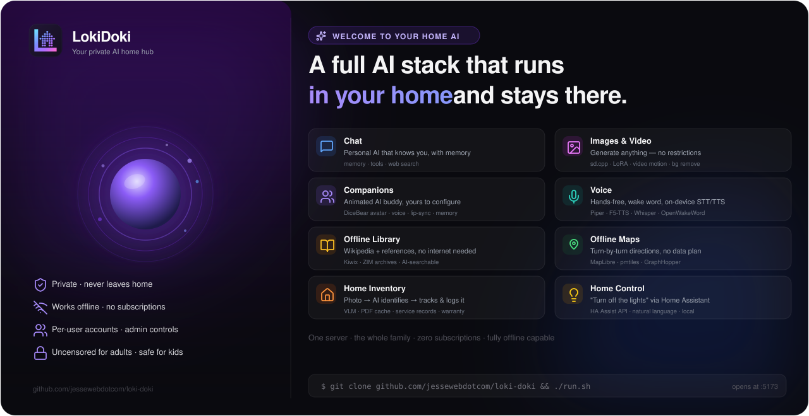

<picture>
  <source media="(prefers-color-scheme: dark)"  srcset="assets/hero.svg">
  <source media="(prefers-color-scheme: light)" srcset="assets/hero.svg">
  
</picture>

<p align="center">
  
</p>

<p align="center">
  
  &nbsp;
  
  &nbsp;
  
</p>

<p align="center">
  
  &nbsp;
  
  &nbsp;
  
</p>

<p align="center">
  <a href="https://jessewebdotcom.github.io/loki-doki"><b>Documentation</b></a>
  &nbsp;·&nbsp;
  <a href="#-quick-start"><b>Quick start</b></a>
  &nbsp;·&nbsp;
  <a href="https://jessewebdotcom.github.io/loki-doki/user/getting-started/"><b>Setup guide</b></a>
</p>

<br/>

One server. The whole family. Zero subscriptions. No corporation reads your chats, no third-party server holds your history, and no content filter decides what you can say, ask, or create. For adults: chat freely and generate what you want. For your kids: a safe, controlled space where nothing they say is harvested, profiled, or sold. When you want live information the AI fetches it; everything else runs locally with no internet required.

<br/>

<p align="center">
  
</p>

<br/>

---

## 🏠 Built for Families

When your kids talk to a cloud AI, those conversations are stored on corporate servers that can be breached, subpoenaed, or used to build profiles that predators and scammers exploit. Loki Doki keeps all of that at home.

<br/>

<table width="100%">
<tr>
<td width="50%" valign="top">
  
  <b>Per-user accounts &amp; PIN login</b><br/>
  Each family member gets their own profile, memory, and preferences, completely isolated from everyone else.
  <br/><br/>
</td>
<td width="50%" valign="top">
  
  <b>Adult content is PIN-gated</b><br/>
  Explicit content is invisible to kids and time-limited for adults. You set the rules, not a corporation.
  <br/><br/>
</td>
</tr>
<tr>
<td width="50%" valign="top">
  
  <b>Per-user feature access</b><br/>
  The admin decides what each person can see and use: chat, images, voice, maps, and more.
  <br/><br/>
</td>
<td width="50%" valign="top">
  
  <b>No data collection, ever</b><br/>
  Your kids' conversations live only on your hardware. No corporate server sees them, ever.
  <br/><br/>
</td>
</tr>
<tr>
<td width="50%" valign="top">
  
  <b>No ads, profiles, or tracking</b><br/>
  Nothing your family says is being used to target, profile, or sell to data brokers.
  <br/><br/>
</td>
<td width="50%" valign="top">
  
  <b>Full admin control</b><br/>
  One admin account owns the server. Grant or revoke any user's access at any time.
  <br/><br/>
</td>
</tr>
</table>

<br/>

<p align="center">
  
  &nbsp;&nbsp;&nbsp;
  
</p>
<p align="center">
  <sub>Every family member gets their own space — and the admin sets each person's content ceiling.</sub>
</p>

---

## ✨ What You Get

<br/>

<table width="100%">
<tr>
<td width="50%" valign="top">
  <br/>
  <b>Chat</b><br/>
  An AI that knows you, remembers your conversations, and can look things up for you in real time. Runs entirely on your hardware.
  <br/><br/>
</td>
<td width="50%" valign="top">
  <br/>
  <b>Images &amp; Video</b><br/>
  Describe anything and the AI creates it. No content restrictions or refusals for adults. Full LoRA support for custom styles.
  <br/><br/>
</td>
</tr>
<tr>
<td width="50%" valign="top">
  <br/>
  <b>Companions</b><br/>
  Browse a store of animated AI buddies, each with its own name, voice, and look. They lip-sync, breathe, tilt their heads, and remember you. Favorite the ones you love and switch anytime.
  <br/><br/>
</td>
<td width="50%" valign="top">
  <br/>
  <b>Voice</b><br/>
  Say a wake word and just talk. The AI listens, responds, and speaks back entirely on-device with Whisper STT and Kokoro TTS.
  <br/><br/>
</td>
</tr>
<tr>
<td width="50%" valign="top">
  <br/>
  <b>Books</b><br/>
  A storefront for ebooks and audiobooks: Project Gutenberg, Standard Ebooks, Internet Archive, and LibriVox, plus your own uploads. Save for later or download for fully offline reading and listening, with AI text-to-speech narration for anything that isn't already an audiobook. An AI authoring tool can also draft an original book from your own premise, chapter by chapter, with your approval at each step.
  <br/><br/>
</td>
<td width="50%" valign="top">
  <br/>
  <b>Offline Maps</b><br/>
  Maps and turn-by-turn directions with no data plan required. Your region, stored locally.
  <br/><br/>
</td>
</tr>
<tr>
<td width="50%" valign="top">
  <br/>
  <b>Reference</b><br/>
  Full Wikipedia, repair guides, medical references, a dictionary, and more, all readable with no internet. AI-searchable, and the companion can cite them directly in chat.
  <br/><br/>
</td>
<td width="50%" valign="top">
  <br/>
  <b>Canvas</b><br/>
  An editable side pane the companion writes code, documents, and HTML into, live, as it works. Keep editing after it's done, and export to PDF.
  <br/><br/>
</td>
</tr>
<tr>
<td width="50%" valign="top">
  <br/>
  <b>Home Inventory</b><br/>
  Photograph any device and the AI identifies it, tracks it, stores the manual, and keeps service records with warranty alerts.
  <br/><br/>
</td>
<td width="50%" valign="top">
  <br/>
  <b>Home Control</b><br/>
  "Turn off the office lights" or "lock the front door." Drives your Home Assistant in natural language, on your own network.
  <br/><br/>
</td>
</tr>
<tr>
<td width="50%" valign="top">
  <br/>
  <b>Videos</b><br/>
  One place for all your video stuff: YouTube, TikTok, Vimeo, Reddit, and your own clips in a single private app that gives your family a safer, calmer watch - no profiling, honest titles instead of clickbait, optional sponsor-segment skipping, and AI-tidied descriptions that filter the scam bait aimed at kids and seniors. You're in control, not an algorithm: you pick the sources, the feed is your subscriptions, and every cleanup is a reversible toggle. Follow creators, audio mode with a live EQ, mini player and PiP, offline rules that keep the latest videos downloaded, background enhancement, per-source Plex libraries, and one-click video-to-podcast.
  <br/><br/>
</td>
<td width="50%" valign="top">
  <br/>
  <b>Podcasts</b><br/>
  Turn articles, videos, or any content into AI-generated audio shows you can listen to anywhere, in voices you choose.
  <br/><br/>
</td>
</tr>
<tr>
<td width="50%" valign="top">
  <br/>
  <b>Music</b><br/>
  Your own private streaming music service: AI radio stations built from any prompt, a full catalog to browse, synced lyrics, and offline saves, plus offline track generation and MIDI remix.
  <br/><br/>
</td>
<td width="50%" valign="top">
  <br/>
  <b>Shows</b><br/>
  Discover TV series: where to stream, trailers, reviews, and a personal watchlist, with a Plex badge for what's already on your server.
  <br/><br/>
</td>
</tr>
<tr>
<td width="50%" valign="top">
  <br/>
  <b>Movies</b><br/>
  Discover films: where to stream, showtimes playing near you, trailers and reviews, with the same Plex integration as Shows.
  <br/><br/>
</td>
<td width="50%" valign="top">
  <br/>
  <b>News</b><br/>
  Your own RSS reader and news hub: global headlines, local stories, and your personal feeds, in categories you control. No algorithm.
  <br/><br/>
</td>
</tr>
<tr>
<td width="50%" valign="top">
  <br/>
  <b>Bookmarks</b><br/>
  Save links and articles, archive full pages for clean, distraction-free offline reading, and organize it all in a private library.
  <br/><br/>
</td>
<td width="50%" valign="top">
  <br/>
  <b>Time</b><br/>
  World clock, alarms, timers, and a stopwatch. Your companion announces alarms and timers out loud when they go off.
  <br/><br/>
</td>
</tr>
<tr>
<td width="50%" valign="top">
  <br/>
  <b>Shopping</b><br/>
  Track prices across Amazon, Walmart, Target, and more from one search box, get price-drop alerts, browse today's deals, and clip coupons.
  <br/><br/>
</td>
<td width="50%" valign="top">
  <br/>
  <b>Reverse Lookup</b><br/>
  Look up a property by address or find people by name or phone, using public records, for your own reference.
  <br/><br/>
</td>
</tr>
<tr>
<td width="50%" valign="top">
  <br/>
  <b>Coding</b><br/>
  A real terminal running the Claude Code CLI in its own sandboxed workspace per person, so anyone in the family can vibe-code a project without touching your host machine.
  <br/><br/>
</td>
<td width="50%" valign="top">
  <br/>
  <b>Recognition</b><br/>
  Show the AI any photo and it tells you what's in it: objects, vehicles down to the make and model, text and signs, the scene, and safety flags like fire or a stranger at the door. Runs on a local vision model, so no picture ever leaves your hardware.
  <br/><br/>
</td>
</tr>
<tr>
<td width="50%" valign="top">
  <br/>
  <b>Clips</b><br/>
  Paste a link from TikTok, Instagram, X, Reddit, Vimeo, or almost any site and watch it right away or save it offline, in a calm private player with no feed, no account, and no algorithm deciding what plays next.
  <br/><br/>
</td>
<td width="50%" valign="top">
  <br/>
  <b>Drop</b><br/>
  Send files, photos, and text between your own devices like AirDrop for the household. Everything hops across your home network through your own server and never touches the cloud.
  <br/><br/>
</td>
</tr>
</table>

### 🏠 Home &amp; Cameras

**Home Control** drives Home Assistant in natural language, **Home Inventory** tracks your devices and appliances with photos and manuals, and a **Frigate** integration lets your companion announce camera events like a person at the door or a car in the driveway, entirely on your own network.

### 🧰 Everyday Tools

A **Today dashboard** (news, sports, weather, on-this-day history, holidays, local events), **Voice Memos**, **Skills** for custom companion behaviors, **Recipes**, a **Speed Test** for your connection, and **unit** + **file converters**, plus a **Links** launcher for your home network. Everything installs per household from the **App Store**, sits on a **customizable drag-and-drop home**, and respects full **multi-user** accounts where the admin controls every user's access.

---

## 🤖 Your Companion

Most AI companion apps are designed to hook you: flattering you, creating emotional dependency, nudging you to spend more time in the app. Loki Doki's companions are different. **They are yours.**

You configure the name, personality, voice, and look. The companion comes to life as an animated avatar: it breathes, tilts its head when it's thinking, and lip-syncs to its own voice. It remembers your conversations and grows with you: a genuine buddy, not a product designed to manipulate you. No subscription to keep it "alive." No company that can push an update and change its personality. It runs on your hardware, belongs to your family, and stays exactly the way you set it up.

---

## 🚀 Quick Start

```sh
git clone https://github.com/jessewebdotcom/loki-doki.git
cd loki-doki
./run.sh
```

A browser opens at `http://localhost:5173`. The setup wizard creates your admin account and downloads models, about 10 minutes start to finish.

> **Requirements:** Windows, macOS, or Linux with a reasonably modern GPU. `run.sh` installs [Bun](https://bun.sh) automatically. [Ollama](https://ollama.com) downloads on first run. Nothing to install by hand.

---

## 🛠 Tech Stack

<p align="center">
  
  
  
  
  
  
</p>
<p align="center">
  
  
  
  
  
</p>

---

## 📖 Documentation

- [User Guide](https://jessewebdotcom.github.io/loki-doki/user/welcome/): getting started, features, and settings
- [Developer Guide](https://jessewebdotcom.github.io/loki-doki/dev/architecture/): architecture, API, and contributing

---

## ⚖️ Disclaimer

Loki Doki is open-source software for **personal, self-hosted, non-commercial use** by you and your household. It is not affiliated with, endorsed by, or sponsored by YouTube, Google, TikTok, Vimeo, Reddit, Plex, or any other platform it can connect to; all product names and trademarks belong to their respective owners. You are responsible for how you use the software and for complying with the terms and laws that apply to you and the services you access. Community datasets used for sponsor-skipping and title cleanup come from [SponsorBlock](https://sponsor.ajay.app/) and [DeArrow](https://dearrow.ajay.app/) (CC BY-NC-SA 4.0) - see [NOTICE](NOTICE) for full third-party attributions.
