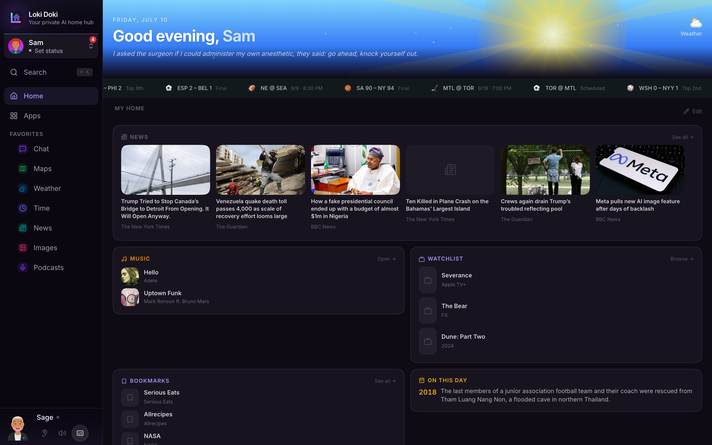
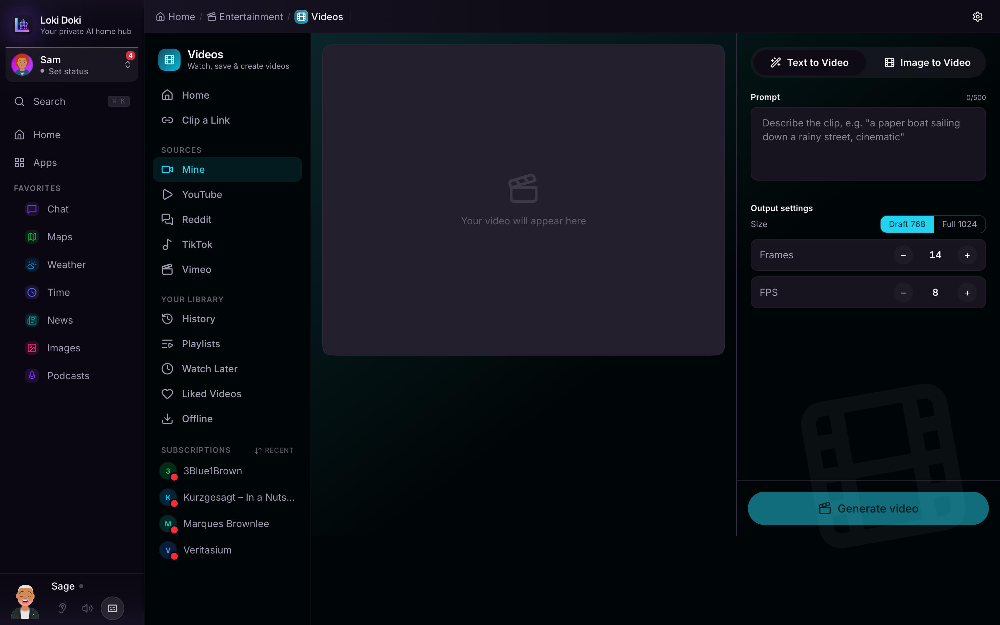
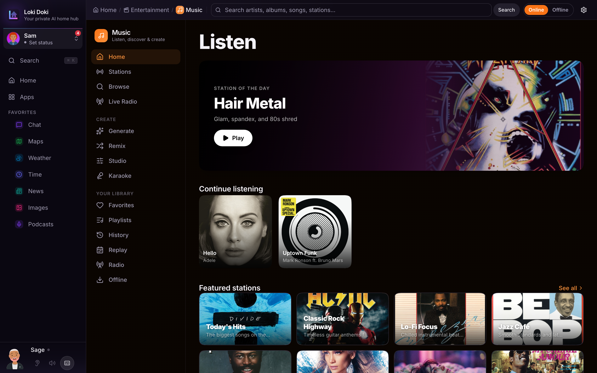
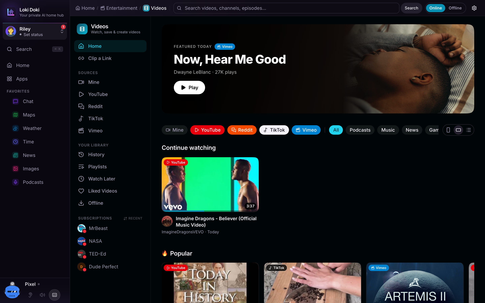
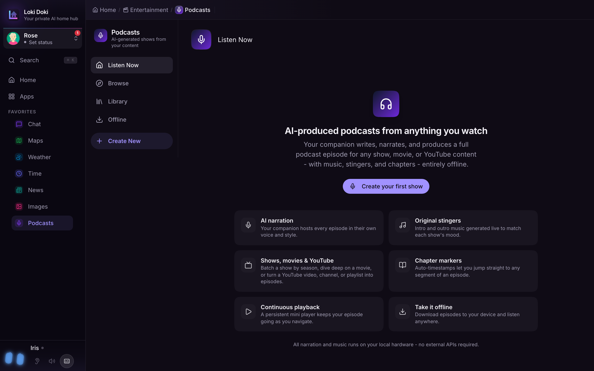
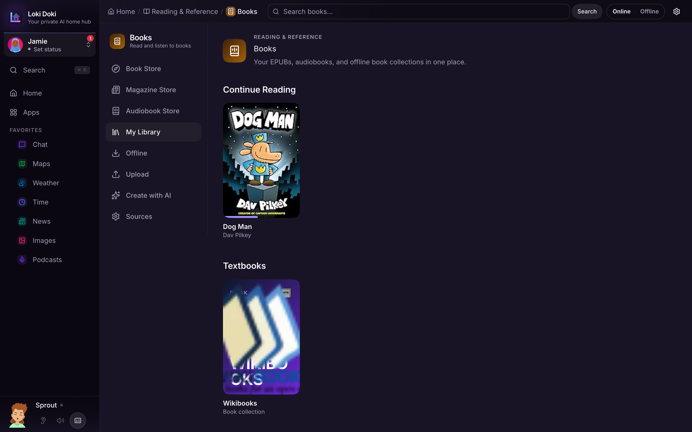
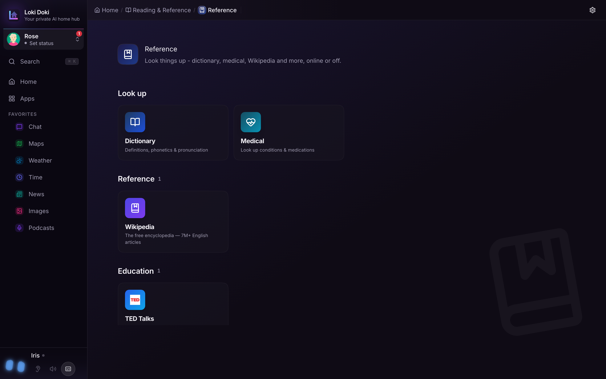
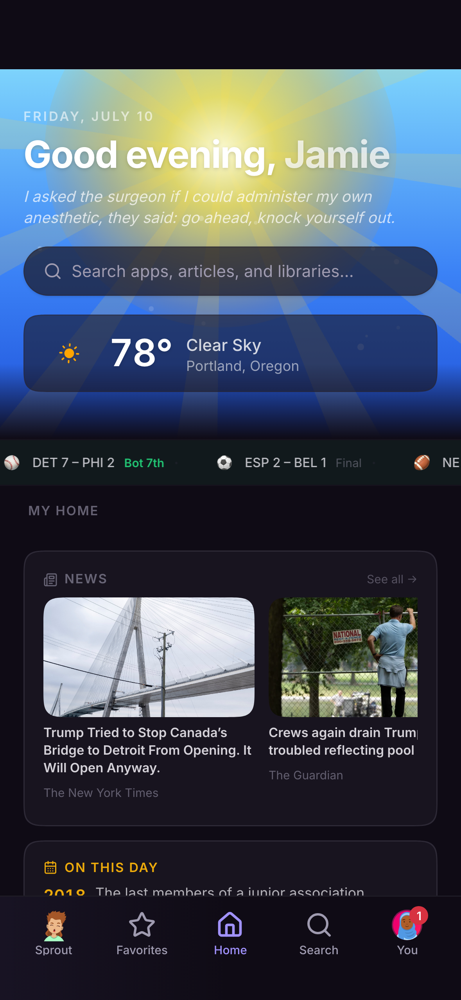
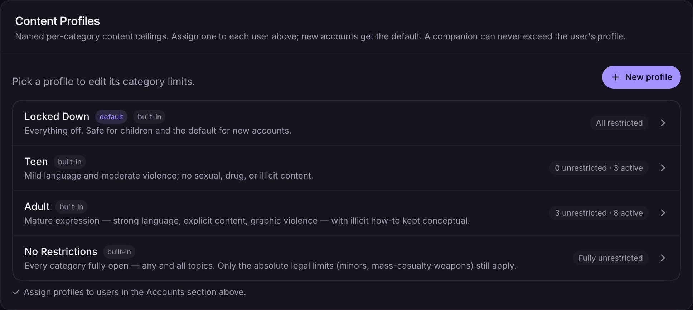

<h1 align="center">Loki Doki</h1>

<p align="center">
  <b>A private AI hub for the whole family — chat, images, music, videos, books, and maps, served from your own hardware.</b><br/>
  Nothing your family says, asks, or creates ever leaves the house.
</p>

<p align="center">
  
  &nbsp;
  
  &nbsp;
  
</p>

<p align="center">
  <a href="https://jessewebdotcom.github.io/loki-doki"><b>Documentation</b></a>
  &nbsp;·&nbsp;
  <a href="#-quick-start"><b>Quick start</b></a>
  &nbsp;·&nbsp;
  <a href="https://jessewebdotcom.github.io/loki-doki/user/getting-started/"><b>Setup guide</b></a>
</p>



**What it is:** one server in your house that gives your whole family private versions of the things they already use — AI chat, image generation, music, videos, podcasts, books, maps, and news — with no cloud accounts and no subscriptions.

**Why you'd want it:**

- 🔒 **Nothing leaves home.** Conversations, photos, and history live on your hardware. No corporation reads them, profiles your kids, or sells them.
- 👨‍👩‍👧 **Safe for kids, uncensored for adults.** Every person gets their own space and a content ceiling — kid-safe by default, no filters for grown-ups.
- 🔌 **Works with the internet down.** When you want live information the AI fetches it; everything else runs fully offline.

## 🚀 Quick Start

**Run the server** on one machine in your house — Windows, macOS, or Linux with a reasonably modern GPU. Everything else installs automatically:

```sh
git clone https://github.com/jessewebdotcom/loki-doki.git
cd loki-doki
./run.sh     # macOS / Linux
.\run.ps1    # Windows
```

The setup wizard opens at `http://localhost:3000`, creates your admin account, and downloads models — about 10 minutes start to finish.

**Then use it from anywhere:**

- 🌐 **Any browser** — phones, tablets, and laptops visit `http://<your-server>:3000`. Nothing to install.
- 🏝 **Doki Dock** — the optional desktop app ([macOS and Windows](https://jessewebdotcom.github.io/loki-doki/user/features/desktop/)) that pins your companion to the top of your screen. See [Your Companion](#-your-companion).
- 📟 **Pods & displays** — flash a supported device like the M5Stack Tab5 into a hands-free voice companion with its own alarms and bedside dashboard, or turn a spare tablet into an ambient home display.

## ✨ See It in Action

<table width="100%">
<tr>
<td width="50%" valign="top">
  <a href="https://jessewebdotcom.github.io/loki-doki/user/features/chat/"></a>
  <p><b>💬 Chat</b> — an AI that remembers your family and never phones home. Search every conversation, keep every version of an answer, and go incognito with temporary chats.</p>
</td>
<td width="50%" valign="top">
  <a href="https://jessewebdotcom.github.io/loki-doki/user/features/image-generation/"></a>
  <p><b>🎨 Images</b> — create anything on your own GPU. Nothing uploaded, nothing filtered for adults.</p>
</td>
</tr>
<tr>
<td width="50%" valign="top">
  <a href="https://jessewebdotcom.github.io/loki-doki/user/features/videos/"></a>
  <p><b>🎬 Video Creation</b> — a text prompt or an image becomes a video clip, generated at home.</p>
</td>
<td width="50%" valign="top">
  <a href="https://jessewebdotcom.github.io/loki-doki/user/features/music/"></a>
  <p><b>🎵 Music</b> — your own streaming service: AI radio with a live DJ, synced lyrics, karaoke.</p>
</td>
</tr>
<tr>
<td width="50%" valign="top">
  <a href="https://jessewebdotcom.github.io/loki-doki/user/features/videos/"></a>
  <p><b>📺 Videos</b> — YouTube, TikTok, Vimeo, and Reddit in one calm app. No ads, no algorithm aimed at your kids.</p>
</td>
<td width="50%" valign="top">
  <a href="https://jessewebdotcom.github.io/loki-doki/user/features/podcasts/"></a>
  <p><b>🎙 Podcasts</b> — your companion writes and narrates full episodes about any show or channel, offline.</p>
</td>
</tr>
<tr>
<td width="50%" valign="top">
  <a href="https://jessewebdotcom.github.io/loki-doki/user/features/books/"></a>
  <p><b>📚 Books</b> — ebooks, audiobooks, comics, and magazines, with a private library per family member.</p>
</td>
<td width="50%" valign="top">
  <a href="https://jessewebdotcom.github.io/loki-doki/user/features/reference/"></a>
  <p><b>🩺 Offline Knowledge</b> — Wikipedia, medical references, and a dictionary that answer with the internet down.</p>
</td>
</tr>
</table>

## 🏠 Built for Families

When your kids talk to a cloud AI, those conversations sit on corporate servers that can be breached, subpoenaed, or used to build profiles that predators and scammers exploit. Loki Doki keeps all of it at home:

- **Per-user accounts with PIN login** — each family member gets their own profile, memory, and preferences.
- **A content ceiling per person** — graduated tiers from kid-safe (the default) through teen and adult to unrestricted. Explicit content is PIN-gated and invisible to kids.
- **Per-user feature access** — the admin grants or revokes chat, images, voice, maps, anything.
- **No ads, tracking, or data collection** — nothing your family says is profiled or sold, ever.

<p align="center">
  
  &nbsp;&nbsp;&nbsp;
  
</p>

## 🤖 Your Companion

Most AI companion apps are designed to hook you. Loki Doki's companions are **yours**: you pick the name, personality, voice, and animated look, and it remembers your family without a subscription keeping it "alive" or a company that can push an update and change its personality. Say the wake word and just talk — speech and voices run entirely on-device.

**Doki Dock**, the optional desktop app for macOS and Windows, pins your companion to the top of your screen as a Dynamic Island–style capsule — wake word armed, one hotkey away, and aware of what's on screen when you ask. It talks only to your server.

<p align="center">
  
</p>

## 🧰 And Everything Else

- **Offline Maps** — maps and turn-by-turn directions with no data plan, your region stored locally.
- **Shows & Movies** — where to stream, trailers, showtimes, and a watchlist, with Plex integration.
- **News** — global, local, and personal feeds in categories you control. No algorithm. Local stories and weather follow where you actually are, not just your home town.
- **Bookmarks** — save links and archive full pages for clean, offline reading.
- **Shopping** — price tracking and drop alerts across Amazon, Walmart, and Target.
- **Recognition** — show it any photo and a local vision model tells you what's in it.
- **Canvas** — a live side pane the companion writes documents and code into.
- **Home Control & Cameras** — drive Home Assistant in plain language; Frigate announces a person at the door.
- **Home Inventory** — photograph a device and the AI identifies it, files the manual, and tracks warranties.
- **Clips** — paste a link from almost any site and watch or save it. No account, no feed.
- **Drop** — AirDrop-style transfer between your devices, through your own server.
- **Coding** — a sandboxed Claude Code terminal per person, so anyone can build without touching your host.
- **Reverse Lookup** — property and people lookups from public records.

Plus a Today dashboard, time & alarms, voice memos, recipes, speed test, file and unit converters, and a links launcher — all installed per household from the built-in App Store onto a drag-and-drop home screen.

## 🛠 Tech Stack

<p align="center">
  
  
  
  
  
  
</p>
<p align="center">
  
  
  
  
  
</p>

## 📖 Documentation

- [User Guide](https://jessewebdotcom.github.io/loki-doki/user/welcome/) — getting started, features, and settings
- [Developer Guide](https://jessewebdotcom.github.io/loki-doki/dev/architecture/) — architecture, API, and contributing

## 📄 License

[AGPL-3.0](LICENSE) — free to use, modify, and self-host. If you distribute a modified version, or host one for people outside your household, you must share your source under the same terms.

## ⚖️ Disclaimer

Loki Doki is open-source software for **personal, self-hosted, non-commercial use** by you and your household. It is not affiliated with, endorsed by, or sponsored by YouTube, Google, TikTok, Vimeo, Reddit, Plex, or any other platform it can connect to; all product names and trademarks belong to their respective owners. You are responsible for how you use the software and for complying with the terms and laws that apply to you and the services you access. Community datasets used for sponsor-skipping and title cleanup come from [SponsorBlock](https://sponsor.ajay.app/) and [DeArrow](https://dearrow.ajay.app/) (CC BY-NC-SA 4.0) — see [NOTICE](NOTICE) for full third-party attributions.
