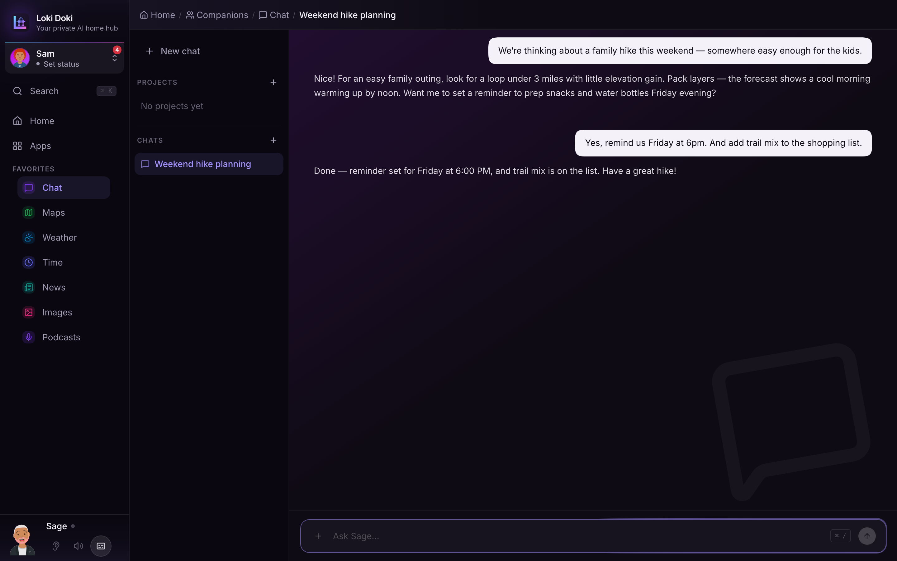

Your chats run on a model on your own hardware. No corporation is reading them, no third-party server keeps your history, and nothing you say is harvested or sold. The AI just remembers _you_.

## Starting a Conversation

Open the Chat page and type your message, or say your wakeword to start hands-free.

Each conversation is saved so you can come back to it. Start a new one any time, or reopen an earlier one from the conversation list. You can pin the chats you want to keep handy, and organize related chats into projects.

## It Remembers You

Over time, the AI quietly picks up the things you tell it: your name, your preferences, the people and places that matter to you. It uses that to give answers that fit your life, without you having to repeat yourself.

It is polite about it, though. It will not bring up something you mentioned weeks ago unless it is actually relevant to what you just asked. No "since you love hiking..." out of nowhere.

## What the AI Can Do

When a question needs more than a chat, the AI reaches for the right tool on its own. It can:

- Answer questions and have a normal conversation
- Look things up on the web
- Check the weather and what to wear
- Tell you the time, date, or how many days until something
- Do math and convert units
- Look up a word's meaning
- Find recipes and videos
- Check sports scores, the news, and local events near you
- Tell you if a movie or show is appropriate for your kids
- Create an image from a description
- Control your smart home (lights, thermostat, locks, and more)
- Work with other parts of the app, like your home inventory

You do not have to know which tool to ask for. Just say what you want in plain language.

## Companions

Your companion is available everywhere in the app through the bar at the bottom of the screen, not only on the Chat page. Each companion has its own personality, voice, and look, and the one you have chosen is who you are talking to by default.

You can switch companions from your profile or the companion picker. The Chat page is the place to go when you want to save a conversation or organize work into projects.

## Tips

- **Keep going where you left off**: if you switch pages or close the tab mid-answer, the AI keeps thinking. Come back and the reply is waiting.
- **"Tell me more"**: always works to expand on the previous response.
- **Tool calls take a moment**: when the AI looks something up or controls something, expect a few extra seconds.
- **Stop any time**: hit stop to cut a response short. Whatever was written so far stays.
- **Citations**: when the AI looks something up, you will see small numbered links you can tap to check the source.
