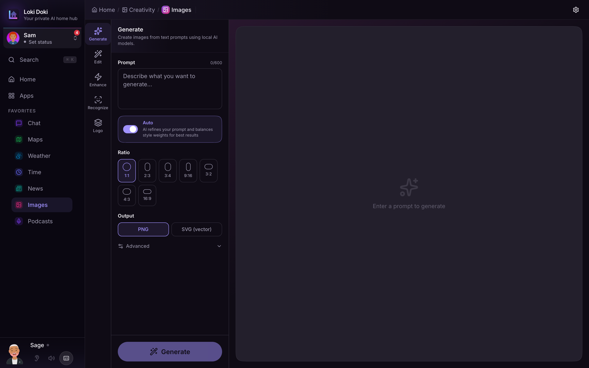

Describe anything in plain words and the Imaging page creates it for you: a photo, a painting, a cartoon, a logo, a short video. Everything runs on your own server, so nothing you create ever leaves your home network. For adult accounts there are no refusals or restrictions; accounts with content filtering enabled stay family-friendly automatically.

The Imaging page has four areas along the side: **Generate**, **Edit**, **Recognize**, and **Logo**.

## Generate

Type a description of what you want and tap **Generate**. The AI refines your wording, adds the right quality details behind the scenes, and starts creating. You will see a live preview sharpen as it works.

Tips for great results:

- Describe the subject, style, lighting, and mood: _"a cozy cabin in the woods at sunset, warm lighting, oil painting style"_.
- Mention the shape if it matters: _"portrait"_, _"landscape"_, or _"square"_.
- Name a style and it follows: anime, watercolor, oil painting, cartoon, pixel art, 3D render, sketch, or photo-realistic.
- You do not need to add "high quality" or "detailed". That is handled for you.

You can also ask your companion in chat to "generate an image of..." and it will create one for you there.

### Styles and LoRAs

LoRAs are optional style add-ons: a particular art style, an artist's look, a type of subject, and so on. Pick one or more from the visual grid before generating, and combine them freely. Your admin controls which LoRAs are available to you, so the list you see is yours.

## Edit

Already have an image (yours or an upload)? The Edit tab transforms it:

- **Enhance**: sharpen details and lift overall quality, with adjustable strength.
- **Auto Color** and **Adjust**: quick color and lighting fixes, or hands-on brightness, contrast, saturation, and sharpness sliders.
- **Remove BG**: cut out the background and isolate the subject.
- **BG Blur**: keep the subject crisp while softly blurring everything behind it.
- **Upscale 4×**: increase resolution four times over for a crisper, larger image.
- **Face Restore**: repair blurry, old, or AI-generated faces.
- **Old Photo**: rescue damaged or faded photos, enhance faces, and upscale, all in one pass.

Some of these depend on optional helpers your admin can install. If one is unavailable, the page tells you what is missing.

## Video

Open the Video page to bring images to life:

- **Text to Video**: describe a scene and it animates a short clip.
- **Image to Video**: upload a still photo and watch it move, with controls for length, frame rate, and how much motion to add.

Video takes longer than a still image, especially the first time, so give it a moment.

## Recognize

The Recognize tab is the reverse: hand it a photo and it tells you what is in it. Upload an image and choose what to look for. The AI reads the scene and returns:

- A plain-language **description** and the **setting** (driveway, kitchen, street, and so on).
- **Objects**, **text and logos**, and **vehicles** (including brands like FedEx or USPS, and license plates).
- **Safety flags** for things like fire, weapons, or a person on the ground, each rated normal, concerning, or critical.
- Inferred **context**: time of day, likely country, what kind of camera took it, and the weather.

It is handy for understanding security-camera stills, identifying a delivery, or just describing a photo. Past analyses are saved so you can revisit them.

## Logo

The Logo tab designs a clean, crisp logo from a name and tagline. Pick a style (wordmark, badge, icon, abstract, or retro) and your colors, and it generates a sharp, scalable result you can download.

## Gallery

Every image you generate or edit is saved to your gallery. Tap any image to see its details, download it, or use it as the starting point for further edits.
